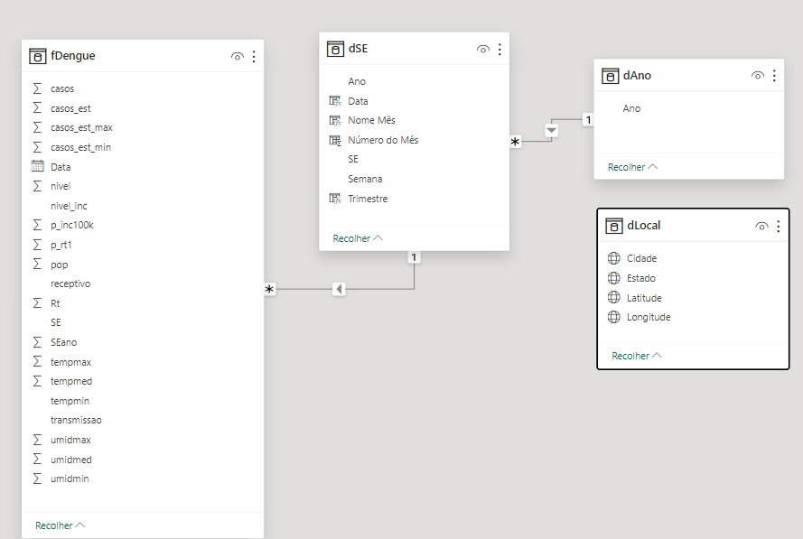
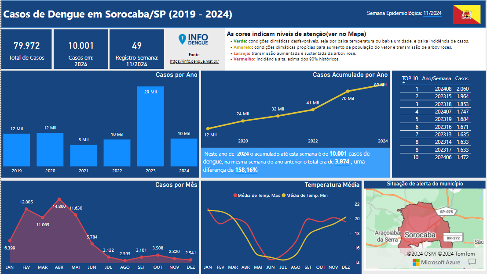

# Dados Dengue Sorocaba
 Dados da Dengue de 2019 a 2024
## Introdução

 A dengue continua a ser um desafio de saúde pública em todo o mundo, e a cidade de **Sorocaba**, no estado de São Paulo, não está imune a essa realidade. Este relatório apresenta uma análise abrangente dos **casos de dengue registrados em Sorocaba de 2019 a 2024**, destacando as tendências, os desafios enfrentados e as medidas adotadas para controlar e combater essa doença.
 
 Ao final deste relatório, espera-se não apenas fornecer uma visão abrangente dos casos de dengue em Sorocaba durante o período especificado, mas também oferecer **insights valiosos que possam informar estratégias eficazes de saúde pública** para lidar com essa importante questão de saúde na região.

 ## Início do projeto
 
 Precisava encontrar uma maneira de coletar os dados atualizados e seguros relacionados aos casos de dengue(Sorocaba/SP). Foi então que encontrei o site (Info Dengue) https://info.dengue.mat.br/ com API, downloads e análises já prontas!😀

Para entender o que estava sendo retornado na API (dicionário de dados):
https://info.dengue.mat.br/services/api

## Desenvolvimento
Foi realizado todo o trabalho de ETL para remover os campos que não seriam utilizados e criadas outras tabelas para auxiliar nas análises.

## Objetivo

 Durante o período de cinco anos abordado neste estudo, foram coletados dados precisos e abrangentes sobre os casos de dengue em Sorocaba, visando fornecer uma compreensão clara da magnitude do problema e suas variações ao longo do tempo. O total de casos durante todo o período será apresentado, juntamente com uma análise detalhada ano a ano, permitindo uma avaliação precisa das tendências sazonais e anuais.

## Painel Desenvolvido (Print)

## Insights

+ O ano de 2023 foi o recorde de casos com um total de 28.797;
+ Em 2024 na semana 11 de 2024 Sorocaba registra um aumento de 158% do mesmo período do ano de 2023 (Ano e semana);
+ A maioria dos casos são no 1º e 2º trimestre do ano;
+ Uma queda significativa ocorre no 3º e 4º trimestre do ano;
+ Na semana 08 de 2024 foi o recorde com 2.060 casos informados, seguidos da semana 15 de 2023 (1.964) e 18 do mesmo ano (1.853);

## Conclusão
  Espera-se uma alta demanda nas unidades de atendimento nos meses iniciais do ano, para este ano de 2024 ainda poderemos ter um alto número de casos registrado até o fim do mês de maio. (quando os casos começam a diminuir)

## Link para o painel

Acesso o painel detalhado em [Power BI](https://app.powerbi.com/view?r=eyJrIjoiYTIyMWRhZTgtZjViMC00NGFhLTgyYTAtMGFkOTE2ZjJlMzBjIiwidCI6ImVhZWZiZmY5LWFmZmMtNDgwNS1hZTdkLTM4MTUxMWVmOTA3MCJ9).

> [!CAUTION]
> Os dados são coletados diretamente da API, portanto, não é de controle próprio.

